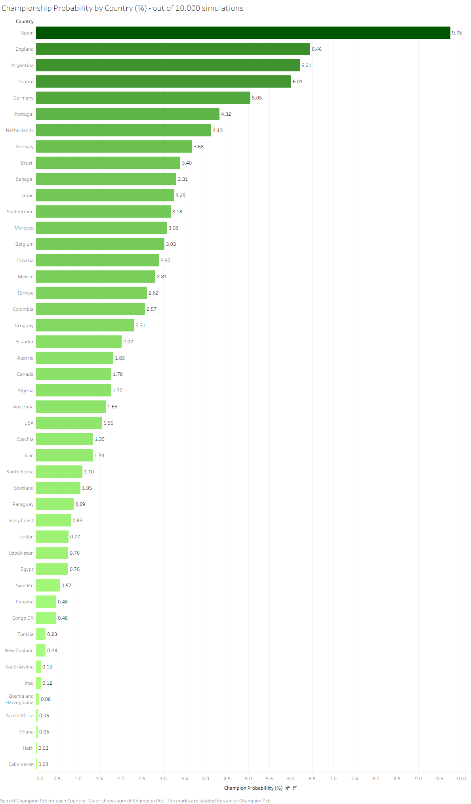
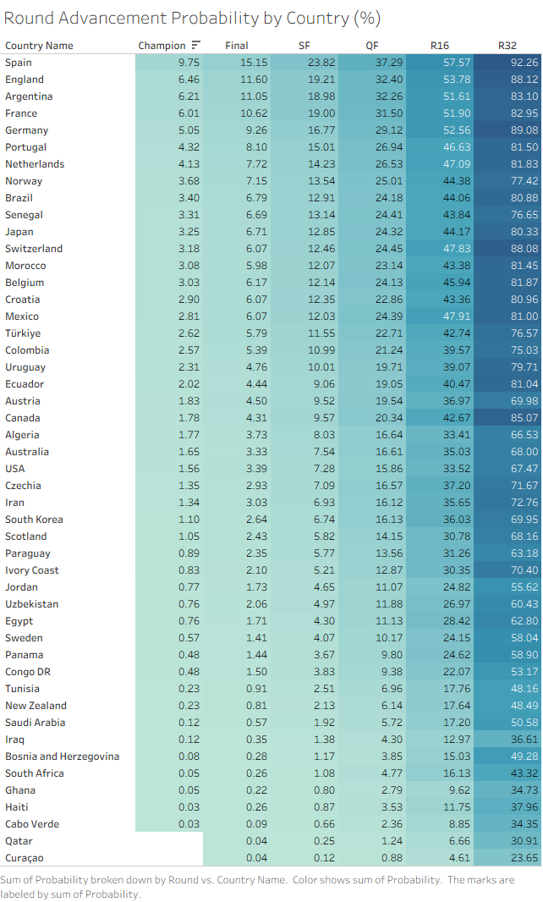
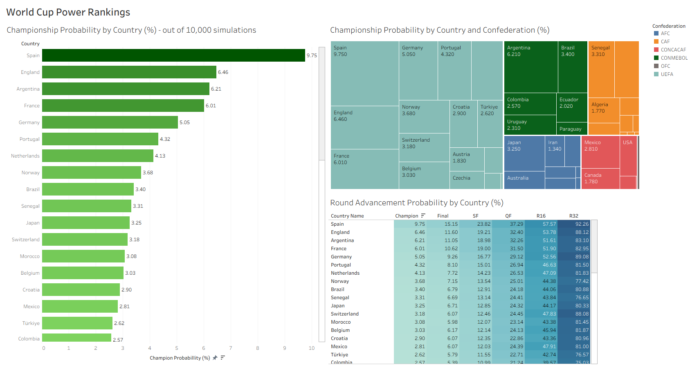
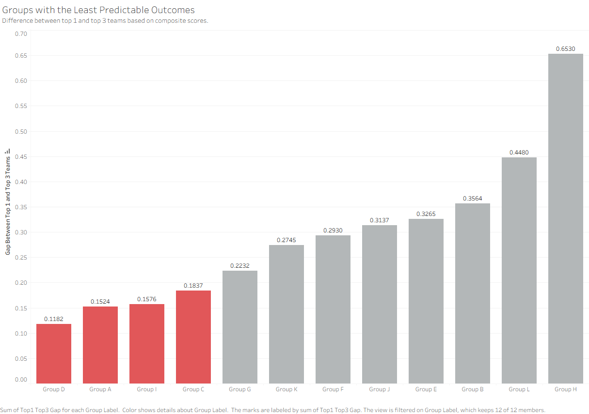
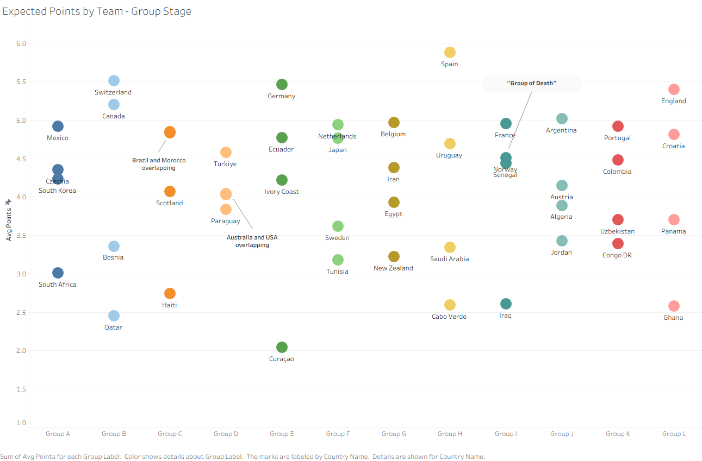
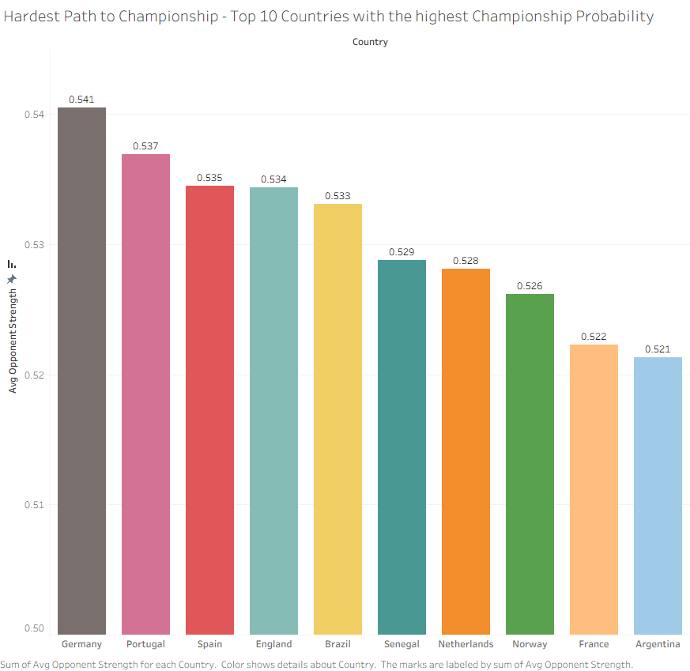
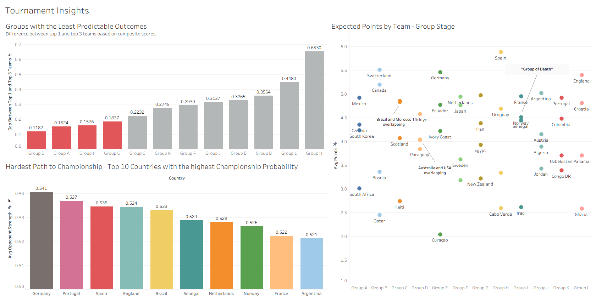
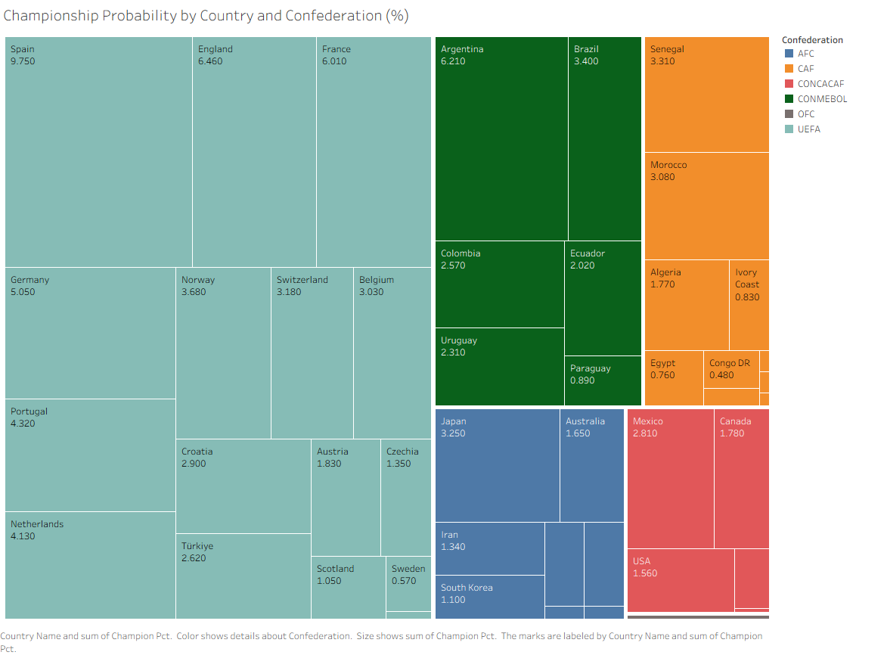

# Analysis Findings - World Cup 2026 Monte Carlo Simulation

This document covers the key findings from 10,000 Monte Carlo simulations of the 2026 World Cup, built on a composite score model combining Elo rating, recent form, squad quality, and club cohesion.

---

## 1. Composite Score Overview

The composite score drives every simulated match outcome. Top 5: Spain (0.910), England (0.791), Argentina (0.784), France (0.765), Germany (0.699).

Spain leads almost entirely on Elo - highest rating in the field (2157) combined with a strong form score and full top-5 league concentration. England and Argentina are close behind, both with high Elo and strong squad quality scores.

A few rankings worth explaining since they diverge from typical betting markets:

**Norway (0.631)** ranks higher than most public perception would suggest. Norway's form score is the 2nd highest in the field (0.900) - their last 20 competitive matches have been excellent, driven largely by Haaland and Ødegaard. Their Elo (1914) is more modest, reflecting historical underperformance before this generation of players. The composite score rewards current form heavily, which is why Norway's composite score sits above teams like Brazil and Croatia.

**Brazil (0.586)** ranks lower than reputation would suggest. Brazil's form score is the lowest among the top 15 (0.253) - poor recent competitive results drag the composite down despite a strong Elo (1991). This is the same mechanism working in the opposite direction from Norway.

**Senegal (0.622)** similarly benefits from a high form score (0.873) on a modest Elo base.

This is a deliberate design choice: the model weights recent form (15%) alongside Elo (55%), top-5 league concentration (15%), club cohesion (10%), and home advantage (5%). A team's *current* trajectory matters, not just their historical reputation. Whether this produces "better" predictions than Elo alone is exactly what a sensitivity analysis (see Limitations) would test.

---

## 2. Championship Probabilities

| Rank | Team | Probability |
|------|------|-------------|
| 1 | Spain | 9.75% |
| 2 | England | 6.46% |
| 3 | Argentina | 6.21% |
| 4 | France | 6.01% |
| 5 | Germany | 5.05% |
| 6 | Portugal | 4.32% |
| 7 | Netherlands | 4.13% |
| 8 | Norway | 3.68% |
| 9 | Brazil | 3.40% |
| 10 | Senegal | 3.31% |

Spain is the clear favorite, winning roughly 1 in 10 simulations - nearly 50% more likely than the next closest contender. The top 4 are tightly clustered between 6.0% and 6.5%, meaning the model sees a genuine four-way race behind Spain.

Qatar and Curaçao won 0 of 10,000 simulations - both have composite scores below 0.12, the lowest in the field. This is expected: Qatar qualified as hosts in 2022 and Curaçao is making their first ever World Cup appearance.

---

## 3. Round Advancement Probabilities

The advancement heat map shows each team's probability of reaching every round from R32 through Champion. A few patterns stand out:

**Front-runners vs deep runners.** Switzerland reaches R32 88.08% of the time - among the highest in the field - but their championship probability (3.18%) is lower than teams with similar or lower R32 rates. Switzerland is strong enough to consistently escape the group stage but struggles to convert that into deep tournament runs.

**Norway's R32-to-Final conversion.** Norway reaches R32 at 77.42% (lower than Portugal's 81.50% despite Norway having the higher form score), but Norway's Final probability (7.15%) actually exceeds Portugal's (8.10%) by a smaller margin than the R32 gap would suggest - meaning once Norway is in, they convert at a higher rate than Portugal does. Ties back to the form-score story in Section 1.

**Germany's QF cliff is the steepest among the top 5.** Germany drops from R16 (52.56%) to QF (29.12%) - a 44.6% relative drop, steeper than Spain's (35.2%), England's (39.7%), Argentina's (37.6%), or France's (39.4%). Among the top 5, Germany faces the hardest knockout draw relative to their group stage strength, which may connect to the "Hardest Path to Champion" finding in Section 7 where Germany also has the highest average opponent strength when they win.

---

## Power Rankings Dashboard

The Power Rankings dashboard combines championship probability, the confederation breakdown, and round advancement into a single view - the model's overall assessment of every team's tournament outlook.

---

## 4. Least Predictable Groups

This chart measures the gap between each group's strongest team (top 1) and 3rd-strongest team (top 3) by composite score. A small gap means the top 3 teams are closely matched - any of them could plausibly finish 1st or 2nd. A large gap means one team dominates and the rest are considerably weaker.

The 4 most unpredictable groups by this measure: Group D (0.118), Group A (0.152), Group I (0.158), Group C (0.184). Group H sits at the opposite extreme (0.653) - Spain is so far ahead of the rest of the group that the outcome there is comparatively easy to call.

A small gap on its own doesn't mean a group is dangerous - it could just mean all 4 teams are similarly weak. Section 6 combines this with overall team strength to identify the actual group of death.

---

## 5. Expected Points by Group

The group breakdown shows average group stage points per team across all 10,000 simulations.

**Group H is effectively decided.** Spain averages 6.0 points - nearly a full point ahead of the next closest team in any group. The other three teams in Group H (Cabo Verde, Uruguay, Saudi Arabia) are competing for the 2nd qualification spot, with Spain's spot essentially locked in.

**Group I stands out.** France, Norway, and Senegal are clustered closely together (4.5-5.0 points), all genuinely competing for 2 spots. Iraq sits well below at roughly 2.5 points - the clear 4th-place team. Section 6 explains why this group is the group of death.

---

## 6. Group of Death

Combining the findings from Sections 4 and 5: a true "group of death" needs both an unpredictable outcome (Section 4) AND multiple teams that are independently strong (Section 5).

**Group I is the group of death.** It is the only group that satisfies both conditions - it has the 3rd smallest top1-top3 gap (0.158), meaning the top 3 teams are closely matched, and it has the highest top-3 average composite score of any group (0.668). France (0.765), Norway (0.631), and Senegal (0.608) are all independently dangerous teams, with only Iraq (0.249) clearly weaker.

Groups D, A, and C are also unpredictable (small top1-top3 gaps), but their top 3 teams are considerably weaker on average - competitive among themselves, but not threats to the rest of the bracket. Group H is the opposite case - Spain is strong enough to make the group's average composite score look high, but the gap between Spain and the rest of the group (0.653) is the largest in the tournament, making Group H one of the most predictable groups rather than a group of death.

---

## 7. Hardest Path to Champion

For the top 10 most likely champions, this measures the average composite score of opponents they beat across all simulations where they won the tournament.

| Team | Avg Opponent Strength |
|------|------------------------|
| Germany | 0.541 |
| Portugal | 0.537 |
| Spain | 0.535 |
| England | 0.534 |
| Brazil | 0.533 |
| Senegal | 0.529 |
| Netherlands | 0.528 |
| Norway | 0.526 |
| France | 0.522 |
| Argentina | 0.521 |

Germany faces the toughest average opposition when they win - likely a reflection of Germany's group draw and bracket position placing them in the path of stronger teams more often than other top contenders.

The spread across all 10 teams is narrow (0.521 to 0.541) - roughly 2 percentage points. This suggests bracket difficulty for the genuinely elite teams is relatively uniform; no top-10 team has a meaningfully "easy" path to the title compared to the others.

---

## Tournament Insights Dashboard

The Tournament Insights dashboard brings together the Least Predictable Groups chart, Hardest Path to Champion, and Expected Points by Group - the analytical findings that go beyond raw probabilities.

---

## 8. Confederation Performance

The treemap shows championship probability by country, grouped and colored by confederation.

**UEFA dominance.** European teams occupy the largest combined share of championship probability by a wide margin - Spain, England, France, Germany, Portugal, Netherlands, and others collectively represent the bulk of realistic title contenders.

**CONMEBOL's concentration.** South America's probability is heavily concentrated in Argentina (6.21%) and Brazil (3.40%) - together these two teams represent the large majority of CONMEBOL's combined championship probability, with Colombia, Ecuador, Uruguay, and Paraguay contributing much smaller shares.

**CONCACAF's host advantage visible.** Mexico (2.81%), Canada (1.78%), and USA (1.56%) all show meaningfully higher probabilities than their composite scores alone would suggest - the host nation bonus is visible in the treemap even though none of the three are realistic title contenders.

---

## 9. Third-Place Qualification Thresholds

Across all 10,000 simulations, tracking the points total of the lowest-ranked qualifying third-place team:

- **4 points qualified 100% of the time** - no simulation ever saw a team with 4 points as their group's 3rd-place finisher fail to advance.
- **3 points qualified 94.17% of the time**
- **Minimum cutoff ever observed: 2 points**

This is the clearest practical takeaway for fans: a team finishing 3rd in their group with 4 points (e.g. one win and one draw from three matches) can be confident of advancing. At 3 points, there's roughly a 1-in-17 chance it isn't enough.

**Caveat:** tiebreakers in this simulation are resolved randomly rather than by goal difference. This affects *which* teams end up with group_rank 3 in close finishes, but does not change the underlying points totals produced by match outcomes. The 94.17% figure should be read as a reasonable estimate rather than an exact probability (see Model Limitations & Future Work).

---

## Model Limitations & Future Work

- **Fixed 25% draw probability** in group stage matches, regardless of how evenly matched the two teams are. A future version could scale draw probability based on the composite score gap between teams.
- **Random tiebreakers** - goal difference is not tracked, so ties in points are broken randomly. Over 10,000 simulations this averages out for most analyses but introduces some uncertainty in close calls (see Section 8).
- **Current Elo as historical proxy** - opponent strength in the form score calculation uses each team's *current* Elo rating, not their rating at the time the match was played. Elo is relatively stable over the 2-3 year window used, but this is an approximation.
- **Weak regional opposition inflation** - teams that play primarily within weaker confederations (e.g. Haiti, Jordan) may have inflated form scores relative to teams that regularly face stronger opposition.
- **Sensitivity analysis (planned)** - testing how championship probabilities shift under alternative weightings (e.g. Elo-only baseline, form-heavy, squad-quality-heavy) would clarify how much each component of the composite score actually drives the results, and whether the model meaningfully outperforms a simple Elo ranking.
